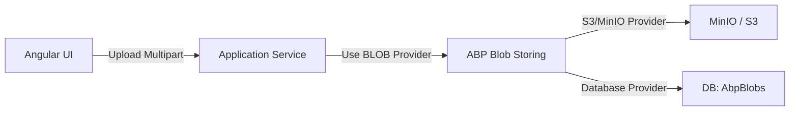

# Planejamento de Armazenamento de Imagens (Logo e Banner)

Este documento descreve a estratégia para implementar o upload e armazenamento de logos e banners de artistas no ShowZen.

## Objetivo
Permitir que usuários façam upload de arquivos de imagem diretamente na tela de cadastro/edição de artistas, substituindo os campos de URL atuais por um seletor de arquivos.

## Arquitetura Sugerida

A arquitetura seguirá o padrão do ABP Framework para armazenamento de arquivos binários (Blobs).

## Opções de Armazenamento

| Característica | Opção A: Banco de Dados (BLOB) | Opção B: MinIO (S3 Compatible) |
| :--- | :--- | :--- |
| **Complexidade** | Baixa (já configurado no ABP) | Média (requer novo serviço Docker) |
| **Performance** | Menor (overload no Postgres) | Alta (serviço dedicado a arquivos) |
| **Escalabilidade** | Limitada pelo tamanho do DB | Alta (Storage independente) |
| **Configuração** | In-box | Requer docker-compose e chaves S3 |

> [!TIP]
> **Recomendação:** Para o estágio atual (MVP/Desenvolvimento), o armazenamento no **Banco de Dados** é mais rápido de implementar. Para **Produção**, o **MinIO** ou **AWS S3** é a escolha profissional.

## Plano de Implementação

### 1. Backend (.NET)
- [ ] **Configurar Contêiner de Blob:** Criar um `[BlobContainerName("artist-images")]` no domínio.
- [ ] **App Service:** Implementar método `UploadImageAsync(IFormFile file)` no `ArtistAppService`.
- [ ] **DTOs:** Incluir o `byte[]` ou referenciar o `FileName` no `ArtistDto`.
- [ ] **Migrations:** Garantir que o módulo `Volo.Abp.BlobStoring.Database` está mapeado (já está no `ShowZenModule.cs`).

### 2. Frontend (Angular)
- [ ] **Componente de Upload:** Criar ou usar um componente para seleção de arquivos (drag & drop).
- [ ] **Service:** Atualizar o proxy para suportar `FormData` no upload.
- [ ] **Preview:** Mostrar preview da imagem antes e depois do upload.

## Próximos Passos Imediatos

1.  **Escolha do Provedor:** Confirmar se usaremos o Database (mais simples agora) ou MinIO (mais robusto).
2.  **UI Adjustment:** Alterar os inputs de texto em `artists.component.html` para `input type="file"`.

---
*Assinado: Antigravity AI*
